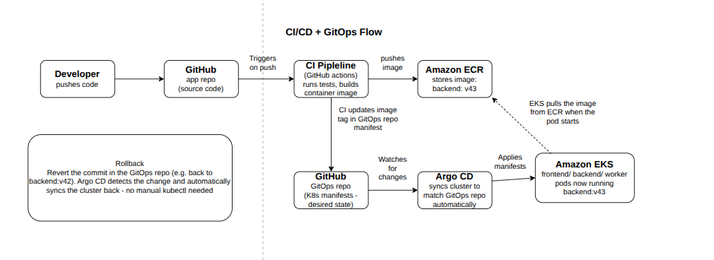

# CI/CD and GitOps Flow

This explains how a code change goes from my laptop into the running app, and how I'd
undo it if something breaks.

## Two repositories

- **App repo** — the actual application code.
- **GitOps repo** — just a description of what should be running right now (e.g. "run
  `backend:v43`"). Keeping it separate from the code means there's always one clear
  place that says what's live.

## The flow

1. I push code to the **app repo**.
2. That **triggers the CI pipeline** (GitHub Actions), which runs tests and, if they
   pass, builds a container image.
3. The pipeline **pushes the image to Amazon ECR**, AWS's image storage.
4. The pipeline then **updates the GitOps repo** with the new image tag.
5. **Argo CD**, running inside the EKS cluster, is always watching the GitOps repo. It
   sees the change and updates the cluster to match.
6. **EKS pulls the actual image from ECR** and starts running it. (Argo CD only sends
   the instruction — the EKS node does the actual download.)

No manual deploy commands anywhere in this process.

## Rollback

If a new version breaks something, I just revert the commit in the GitOps repo back to
the previous tag. Argo CD notices and automatically syncs the cluster back — same
mechanism as a normal deploy, just pointed backward.

## Across environments

The same pipeline runs for dev, staging, and prod, using separate folders in the GitOps
repo for each. A change is tested in dev, promoted to staging, and only the same
already-tested image gets promoted to prod.

## Diagram

