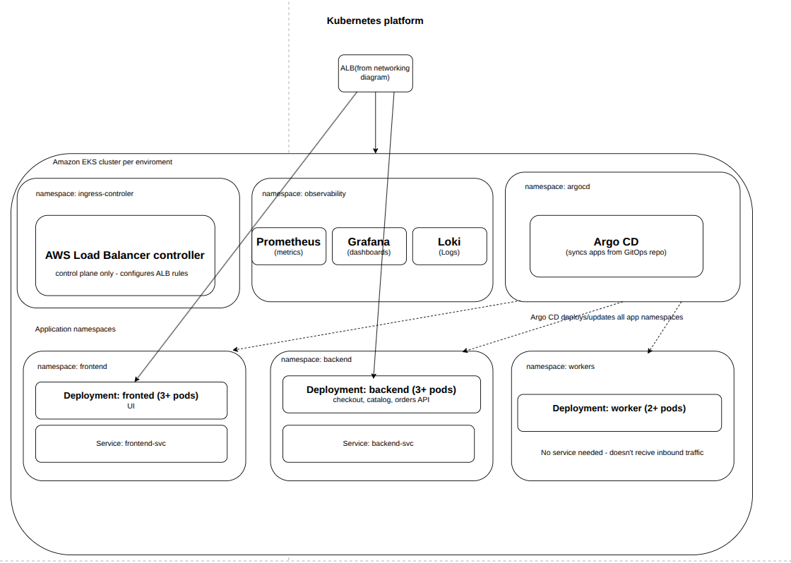

# Kubernetes Platform Design

This document describes what actually runs inside the EKS cluster shown as a single box
in the [README](../README.md) — the namespaces, the core platform components, and how
the application services are grouped. Each environment (dev, staging, prod) gets its own
cluster, and this same structure repeats identically in all three.

## Namespaces

I split the cluster into separate namespaces rather than dumping everything into one, so
that unrelated things stay isolated from each other. Each namespace gets its own
Kubernetes RBAC rules and resource limits (CPU/memory quotas), so one app group can't
accidentally consume all the cluster's resources or read another group's secrets. The
namespaces are: `kube-system` (built-in, managed by AWS), `ingress-controller`,
`observability`, `argocd`, and then one namespace per application group —  `frontend`,
`backend`, and `workers`.

## How traffic gets in: the ingress controller

In the networking diagram, the ALB sends traffic into the cluster, but on its own it
doesn't know anything about individual apps. This is where the **AWS Load Balancer
Controller** comes in — but it's worth being precise about what it actually does,
because it's easy to assume it works like a typical proxy.

The controller does **not** sit in the path of the traffic itself. What it does is watch
for Ingress resources I define (rules like "send `/api/*` to the backend, everything
else to the frontend"), and use those rules to configure the *real* ALB directly, via the
AWS API — setting up its listener rules and target groups. Once that's configured, the
ALB sends requests **straight to the pods**, without passing through the controller pod
at all. The controller is a one-time (well, continuous, but background) setup step, not
something every request travels through. This is actually a meaningful difference from
some other ingress controllers (like nginx-ingress), which genuinely do proxy every
request through themselves — AWS's approach avoids that extra hop.

## How apps are grouped

Each application group gets its own namespace, its own Deployment (which manages the
actual running pods), and — where needed — its own Service (a stable internal address
other things can reach it at):

- **frontend** — a Deployment running the storefront UI, with a Service in front of it
  so the ingress controller has something stable to route to. It calls the backend for
  anything dynamic (checkout, product data).
- **backend** — a Deployment handling the checkout, catalog, and orders API, also with
  a Service in front of it. This is the only app group that talks to RDS and S3
  directly, and it publishes messages to SQS when something needs to happen later.
- **workers** — a Deployment that consumes messages from SQS and does background jobs
  (sending emails, generating invoices). It doesn't need a Service, since nothing sends
  traffic to it directly — it just pulls work off the queue on its own.

Each Deployment runs multiple pod replicas so that if one pod crashes or its node goes
down, the others keep serving traffic without any downtime.

## Observability

The `observability` namespace runs Prometheus (collects metrics from everything in the
cluster), Grafana (turns those metrics into dashboards), and Loki (collects logs). These
scrape and collect from every other namespace in the cluster, which is what gives the
2-person ops team a single place to see what's happening, instead of having to check
each service separately. This is covered in more depth in
[docs/observability-design.md](docs/observability-design.md).

## Deployments

The `argocd` namespace runs Argo CD, which is what actually pushes new versions of the
frontend, backend, and worker apps into their namespaces whenever something changes in
the GitOps repo. I'm only mentioning it briefly here since the full deployment flow —
from a developer's commit all the way to a running pod — is covered in
[docs/cicd-gitops.md](docs/cicd-gitops.md).

## Diagram

