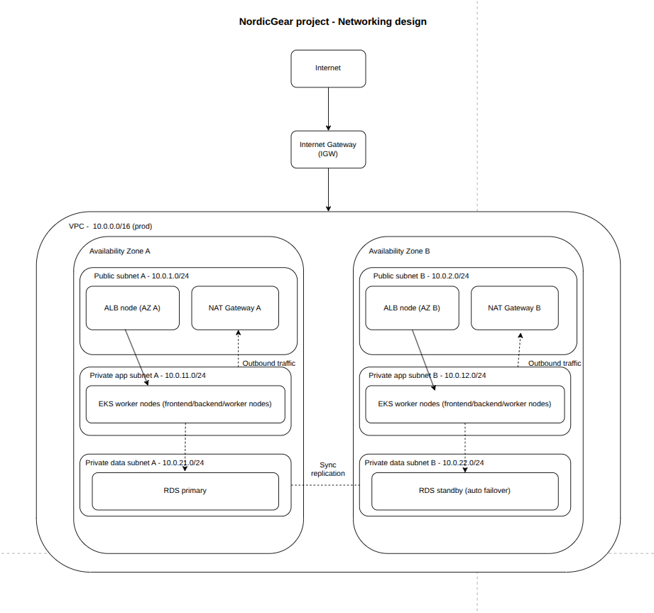

# Networking Design

This document describes the network architecture for the NordicGear cloud platform, including the VPC layout, subnet design, routing, and Availability Zone (AZ) distribution. It complements the overall system architecture described in the main [README](../README.md).

---

## Overview

Each environment (**development**, **staging**, and **production**) has its own dedicated VPC to provide complete network isolation.

- **Production** spans **two Availability Zones** to provide high availability and fault tolerance. If one AZ becomes unavailable, the platform can continue operating from the other.
- **Development** and **staging** use a single AZ because they are intended for testing and do not require the same level of resilience.

Within each Availability Zone, the network follows a standard **three-tier architecture** consisting of:

- **Public subnet** – hosts internet-facing resources such as the Application Load Balancer (ALB).
- **Private application subnet** – hosts Amazon EKS worker nodes.
- **Private data subnet** – hosts Amazon RDS instances.

Only the public subnet is directly accessible from the internet. Application and database resources remain isolated in private subnets.

---

## VPC and Subnets

The production VPC uses the CIDR block:

```text
10.0.0.0/16
```

This provides sufficient address space for multiple subnet tiers across two Availability Zones.

| Availability Zone | Public | Private Application | Private Data |
|-------------------|---------|---------------------|--------------|
| AZ A | 10.0.1.0/24 | 10.0.11.0/24 | 10.0.21.0/24 |
| AZ B | 10.0.2.0/24 | 10.0.12.0/24 | 10.0.22.0/24 |

Development and staging environments follow the same subnet layout while using separate, non-overlapping CIDR ranges within a single Availability Zone.

---

## Routing

### Public subnets

Public subnets route:

```text
0.0.0.0/0 → Internet Gateway (IGW)
```

This allows inbound and outbound internet connectivity for resources such as the Application Load Balancer.

### Private subnets

Private application and data subnets route:

```text
0.0.0.0/0 → NAT Gateway
```

This provides outbound internet access for tasks such as:

- Pulling container images
- Downloading software updates
- Accessing AWS services

Private resources never receive inbound internet traffic because no route exists directly to the Internet Gateway.

Each Availability Zone contains its own NAT Gateway, avoiding a single point of failure and ensuring each AZ can independently maintain outbound connectivity.

---

## Load Balancing

Each environment contains a single **Application Load Balancer (ALB)**.

Although AWS deploys ALB nodes into the public subnet of every Availability Zone, they collectively represent one logical load balancer with a single DNS endpoint.

Cross-zone load balancing distributes requests across healthy targets in both Availability Zones, allowing traffic to continue flowing even if one AZ loses all application nodes.

---

## Compute and Data Placement

### Amazon EKS

Amazon EKS worker nodes are deployed exclusively within the private application subnets.

These nodes:

- Do not receive public IP addresses
- Cannot be accessed directly from the internet
- Receive traffic only through the Application Load Balancer using Kubernetes Ingress

Additional Kubernetes configuration is documented in the Kubernetes platform documentation.

### Amazon RDS

Amazon RDS is configured in **Multi-AZ** mode.

- Primary database instance → AZ A
- Standby replica → AZ B

AWS automatically performs failover if the primary Availability Zone becomes unavailable, allowing the application to continue operating without manual intervention.

---

## Availability Zone Distribution

Both Availability Zones are set up identically for almost everything: each one has its own public subnet, private application subnet, and private data subnet, along with its own ALB node, NAT Gateway, and set of EKS worker nodes.
The one exception is RDS. The primary database instance runs in AZ A, while the standby copy - the one that's kept in sync and ready to take over - runs in AZ B, rather than being duplicated in both.

## Network Diagram


